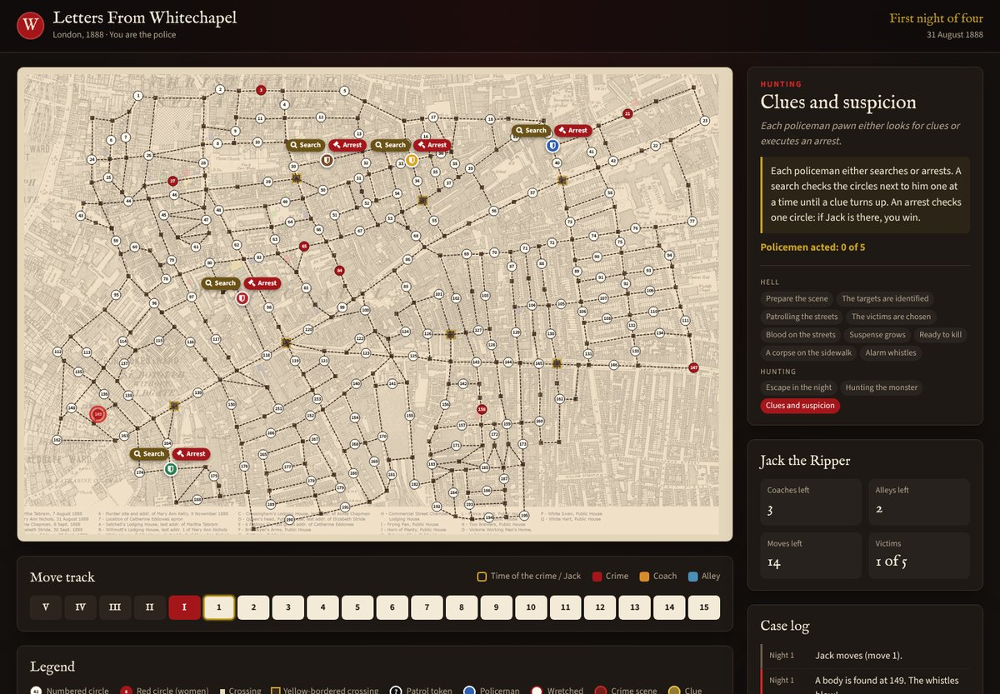

# Letters From Whitechapel

A browser version of the board game *Letters from Whitechapel*. You lead the five police detectives hunting Jack the Ripper through the streets of Whitechapel in 1888, and the computer plays Jack. Over four nights he kills, then tries to slip back to his secret hideout; you place patrols, follow his trail of clues and try to make the arrest.

## Play

Open `index.html` in a browser. There is nothing to install or build.

Before the first night, choose how Jack plays:

| Difficulty | Jack's AI |
|---|---|
| **Easy** (the default) | The baseline AI: simple rules of thumb |
| **Normal** | The strategic AI: weighs the risk of arrest and the time left before every move |
| **Hard** | Jack AI v2: the strategic AI, and he also hides the way to his hideout by walking away from it first |

The labels name the AIs; they are not claims about how a typical human Jack plays. The choice is remembered for the next game, and it only changes how Jack decides: the rules and what Jack is allowed to know are the same. For testing, `index.html?difficulty=normal` (or `hard`, or the older `?jack=strategic`) fixes the level. See [Jack's AI](docs/jack-ai.md#difficulty-levels) and [Jack AI v2](docs/jack-ai-v2.md).

You can also choose who leads the detectives: **you** (the default), or the computer police, whom you then watch hunt Jack. **Easy police** is the original detective AI; **Normal police** is Detective AI v2, which also guards the places Jack could be heading for. `index.html?police=normal` (or `easy`, `you`) fixes the choice for testing. See [Detective AI v2](docs/detective-ai-v2.md).

The game follows the revised edition rulebook: four nights (including the double event), real and fake patrols, the Time of the Crime, Jack's coaches and alleys, and searching for clues or making an arrest. See [Game rules](docs/game-rules.md) for the details and what isn't implemented yet.

## Documentation

Everything about how the game works and how to change it is in [`docs/`](docs/README.md):

- [Architecture](docs/architecture.md): files, data model and the phase state machine
- [Game rules](docs/game-rules.md): the rules as implemented
- [Map data](docs/map-data.md): the board graph and how alleys are worked out
- [Jack's AI](docs/jack-ai.md): how the computer plays Jack, and how the strategic AI was evaluated
- [Jack AI v2](docs/jack-ai-v2.md): why the strategic Jack loses to Detective AI v2, the improvements tried, and the one kept
- [Detective AI v2](docs/detective-ai-v2.md): the stronger computer police, and how it was evaluated
- [User interface](docs/ui.md): layout, components and design tokens
- [Testing](docs/testing.md): running and writing tests (`npm install && npm test`)
- [Contributing](docs/contributing.md), [Roadmap](docs/roadmap.md) and [Changelog](docs/changelog.md)

Contributions are welcome: see [Contributing](docs/contributing.md).

## Credits

This project is a fork of the original browser version by David Apple, who built the map data, the first game logic and the board design.

*Letters from Whitechapel* was designed by Gabriele Mari and Gianluca Santopietro and is a trademark of Tiopi srl, published in English by Fantasy Flight Games. This is an unofficial fan project and is not affiliated with or endorsed by them. Read about the board game on [BoardGameGeek](https://boardgamegeek.com/boardgame/59959/letters-whitechapel).
