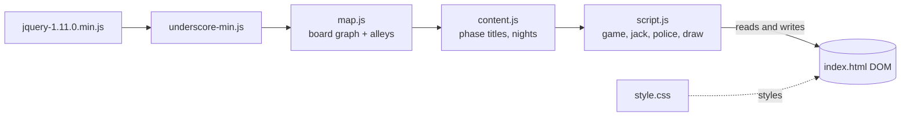
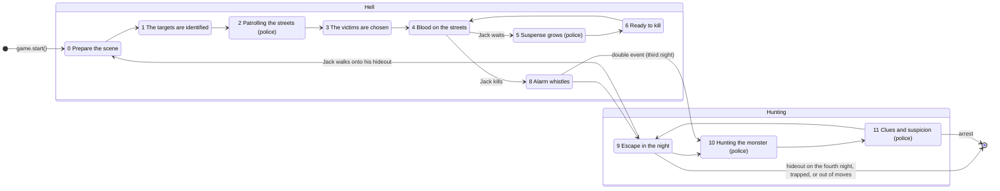

# Architecture

The game is a single page, `index.html`, that loads five scripts in order. There is no build step, no module system and no server: every script adds globals that the next one uses.

## Files

| Path | Purpose |
|---|---|
| `index.html` | The page: top bar, board, move track, legend, sidebar (phase, Jack, case log) and the intro and game-over dialogs. |
| `css/style.css` | All styling. Design tokens are CSS variables on `:root` (see [User interface](ui.md)). |
| `js/map.js` | The board as a graph: 429 places with positions and connections. Computes alleys at load. See [Map data](map-data.md). |
| `js/content.js` | `state[]`: title, part (Hell or Hunting) and description of the 12 phases. `nights[]`: names and dates of the four nights. |
| `js/script.js` | Everything else: the `game` state machine and rules, the `jack` AI, the `police` records and the `draw` helpers. |
| `js/jquery-1.11.0.min.js`, `js/underscore-min.js` | Vendored libraries (jQuery 1.11, Underscore 1.8.3). |
| `css/font-awesome*.css`, `fonts/` | Font Awesome 4.5, for the icons on tokens. |
| `images/vintage-map.jpg` | The 1888 map shown faintly under the streets. |
| `generate-svg-map.html` | A developer tool that prints the streets as SVG `<line>` markup from `map.js`. |
| `svg/`, `construction/`, `images/whitechapel-numbers.jpg` | Design sources. Not loaded by the game. |
| `user-interface.html`, `bootstrap/` | The original UI mock-up and Bootstrap 3. Not used by the game any more. |
| `test/` | Automated tests (see [Testing](testing.md)). |

## Global objects

| Global | Defined in | Holds |
|---|---|---|
| `map` | `map.js` | Array of places, indexed by map id. Helpers: `map.key(name)`, `map.debug()`, `map.computeAlleys()`. |
| `state` | `content.js` | Phase metadata, indexed by phase number (0 to 11). |
| `nights` | `content.js` | `{ name, date, note }` for each night. |
| `game` | `script.js` | `game.config` (all game state) and the phase functions. |
| `jack` | `script.js` | Array with one record per night, plus Jack's AI functions (`jack.move`, `jack.walk` and others). |
| `police` | `script.js` | Array with one record per night. |
| `draw` | `script.js` | Functions that put things on the page. |

`jack` and `police` are arrays with functions attached as properties. `_.last(jack)` is always the current night.

## Data model

### `game.config`

| Field | Meaning |
|---|---|
| `state` | The current phase (see the state machine below). |
| `base` | Jack's hideout (a map id). Secret: never shown to the player. |
| `timeOfCrime` | The Roman numeral the Time of the Crime token is on, 1 (I) to 5 (V). |
| `totalMoves` | 20, the spaces on the move track. |
| `remainingMoves` | Spaces left to the right of Jack's pawn. |
| `carriages`, `alleys` | Coaches and alleys for each night: `[3, 2, 2, 1]` and `[2, 2, 1, 1]`. |
| `women`, `wretched`, `victims` | Women, marked women and murders for each night: `[8, 7, 6, 4]`, `[5, 4, 3, 1]`, `[1, 1, 2, 1]`. |
| `police`, `fakePolice` | 5 real and 2 fake patrol tokens. |
| `womenMarked` | Where the Wretched are (map ids). |
| `womenUnmarked` | Where the decoy women are. |
| `crimeScenes` | Every crime scene so far. They stay for the whole game. |
| `nights` | 4. |
| `over` | `true` once the game has ended. `nextState` then does nothing. |
| `debug` | When `true`, Jack also runs the slow brute-force route search on every move, for the console. |

### A night of Jack: `jack[n]`

| Field | Meaning |
|---|---|
| `route` | Every numbered circle on Jack's sheet tonight, in order, starting with the crime scene(s). Clues are searched against this. |
| `moves` | Each move: `{ mapid, type: 'walk' \| 'alley' \| 'carriage', via }`. `via` is a coach's first stop. |
| `murder`, `murderMove` | Tonight's crime scenes and their move-track spaces. |
| `trackPosition` | The move-track space of Jack's pawn: 1 is V, 5 is I, 6 is 1 and 20 is 15. |
| `carriages`, `alleys` | Special movement tokens left tonight. |

### A night of police: `police[n]`

| Field | Meaning |
|---|---|
| `start`, `fake` | Crossings with real and fake patrol tokens. |
| `revealed` | Patrol tokens Jack has revealed. |
| `now` | Where the five policemen are. Index *i* is always the same policeman (colour `police-i`). |
| `route` | Every crossing each policeman has stood on tonight (Jack's AI uses this). |
| `search`, `arrest` | For the current Clues and suspicion phase: circles each policeman can still search or arrest at. |
| `clue` | Circles where clues were found tonight. |

## The phase state machine

`game.nextState(n)` sets `game.config.state`, clears the phase panel, updates the title and calls the phase function. Phases run by Jack finish at once and call the next state themselves. Phases run by the police draw clickable tokens and wait; their click handlers call `nextState` once every policeman or Wretched has acted.

Phase 7 (A corpse on the sidewalk) has no function of its own: `game.murder` records the crime scene and places Jack's pawn.

## Rendering

- **The board** is a 1000 by 663 pixel `.map` element. `draw.fit` scales it with a CSS transform to fit `.board`, and again on window resize.
- **Places and tokens** are `` elements made by `draw.createElement(mapid, label, classes)`. It positions them absolutely at `map[mapid].position` and stores the map id in `data-mapid`. CSS centres each one on its point.
- **Streets** are an inline SVG generated from the map by `draw.streets`, so they always match the data.
- **Tokens and markers:** clickable tokens have the `token` class and are removed with `$('.token').remove()` when a phase ends. Crime scene markers (`token-murder`) deliberately don't have it, so they stay all game.
- **The sidebar:** `draw.updateTitle` fills the phase card and the night in the top bar, and `draw.phaseText` writes the current instructions. `draw.progress` shows counts such as "Policemen moved: 2 of 5". `draw.jackLog` shows Jack's public status, and `game.log` adds an entry to the case log.

## Starting the game

At the bottom of `script.js`, the intro dialog opens unless `window.WHITECHAPEL_NO_AUTOSTART` is set (the tests set it). Its button calls `game.start()`, which draws the board, picks Jack's hideout and enters phase 0. "Play again" reloads the page.

## Randomness

All randomness goes through `Math.random`: directly, through `game.randomInt`, `game.randomSafe` and `game.randomSafeIndex`, or through Underscore. Tests replace `Math.random` with a seeded generator, so a game can be replayed exactly.
