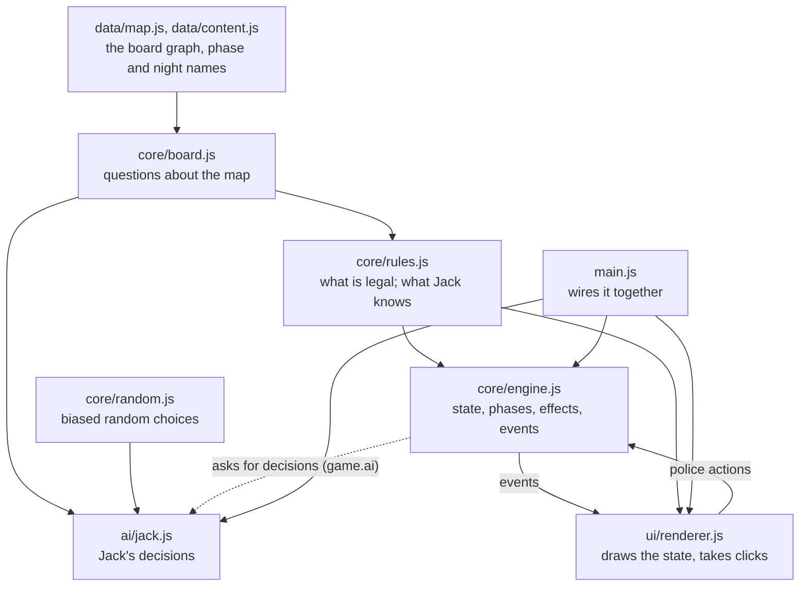
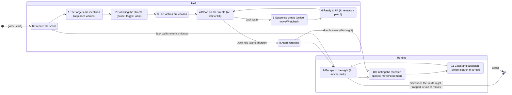

# Architecture

The game is a static page, `index.html`, with no build step. Its JavaScript is split into modules with one job each. Each module is a plain script that adds one object to a single `WC` namespace, and the scripts load in dependency order.

## Components



The same in plain text, reading down from what depends on nothing:

```
  data/map.js ──► core/board.js ──► core/rules.js ──────────────► core/engine.js ◄── police actions ──┐
                        │                 │   gives Jack a view       │   │ events                      │
                        │                 ▼                           │   ▼                             │
  core/random.js ──► ai/jack.js ◄── engine asks for decisions ────────┘  ui/renderer.js ──────────────────┘
                                                                          ▲ (asks rules for legal choices)
                                          main.js: game = engine.create({ ai: jackAI }); ui.attach(game)
```

| Module | Owns | Knows about | Never does |
|---|---|---|---|
| `data/map.js` | The board: 429 places, positions, streets, numbers, red circles, stations; computes alleys at load | Nothing | |
| `data/content.js` | Words for the 12 phases and 4 nights | Nothing | |
| `core/board.js` | Map queries: walking between circles, police steps, adjacent circles, alleys, distances, straight-line distance | The map | Know about a game, a state, or a turn |
| `core/rules.js` | Legality and derived facts about a state: patrol placement, Wretched moves, police destinations, Jack's legal moves, escaping, threats, and the **view** of what Jack knows | Board, a state passed in | Change the state |
| `core/engine.js` | The state; the phases of a night; every change to the state (effects); police actions; events | Rules; the AI only through its six functions | Touch the page; decide anything for Jack |
| `ai/jack.js` | Jack's six decisions | Board, random, the view it is given | Read the state directly, change it, or touch the page |
| `core/random.js` | Biased random choices (`int`, `safe`, `safeIndex`), with an injectable source | `Math.random` by default | |
| `ui/renderer.js` | Drawing the board, tokens, phase card, Jack's panel and case log; turning clicks into engine actions | Board, rules, content, the game it is attached to | Change the state, or decide what is legal |
| `main.js` | Creating the game with Jack's AI and attaching the interface; the intro dialog | Everything above | |

The core (`board`, `rules`, `engine`, `random`) and the AI run without a page. The tests load them into a bare JavaScript context to prove it (`test/helpers/core.js`).

## Why these boundaries

- **Board vs rules.** The board answers questions that would be true in any game on this map: which circles touch a crossing, how far apart two circles are. The rules answer questions about *this* game's state, using the rulebook: which of those moves is legal tonight, given the policemen and tokens. Keeping the map separate lets the AI use geometry and distances without depending on the rules. It also means the rules never re-implement walking.
- **Rules vs engine.** Rules decide; the engine acts. Every rule is a pure function of the state, so the engine, the AI and the interface all ask the same question in the same place. This is the single source of truth: changing a rule means changing one function in `rules.js`.
- **Engine vs AI.** The engine runs the phases and applies decisions, but Jack's choices come from `game.ai`, an object with six functions. The AI gets a **view** from `rules.jackView(state)`: what Jack would know at the table, plus questions he may ask (`walks()`, `specialMoves()`, `distanceToHideout()`, `threats()`, `endsNight()`). The engine checks every decision against the rules before applying it, so a new or experimental AI can't break the game silently.
- **Engine vs interface.** The engine reports what happened as events (`murder`, `jackMoved`, `searchFinished`, ...) and never touches the page. The interface listens and draws. It gets the legal choices to show from the rules, and sends clicks to engine actions (`togglePatrol`, `movePoliceman`, `search`, ...). Each action checks the rules and returns `false` if it isn't allowed. So the page displays state; it doesn't decide what is legal.
- **Case log wording.** The wording lives in the interface. The engine reports facts (`{ type: 'arrestFailed', mapid }`), and the interface writes "Arrest at 82: Jack is not there." A simulation or test can count events without any text.

### Why not ES modules or a bundler

The game is played by opening `index.html` from disk. Browsers refuse to load ES modules from `file://` pages, so modules would force either a local server or a build step to bundle them. Neither buys much for eight small files. Instead, each file is a plain script that adds one object to `WC` and takes its dependencies as arguments, for example `WC.rules = (function (board, _) { ... })(WC.board, _)`. The dependencies are explicit at the bottom of each file, and the load order in `index.html` matches the diagram.

## The state

The engine owns one state object, `game.state`. Nothing else changes it (a test in `architecture.test.js` checks this).

| Field | Meaning |
|---|---|
| `phase` | The current phase (see below) |
| `base` | Jack's hideout (secret) |
| `over`, `result` | Whether the game has ended, and how: `{ type: 'arrested' \| 'trapped' \| 'outOfMoves' \| 'jackWins', mapid }` |
| `timeOfCrime` | The Roman numeral the Time of the Crime token is on (1 to 5) |
| `remainingMoves` | Move-track spaces left to the right of Jack's pawn |
| `womenMarked`, `womenUnmarked`, `crimeScenes` | Where the Wretched, decoy women and crime scenes are |
| `jack[]`, `police[]` | One record per night (below) |
| `turn` | Progress through the current police phase (who has moved or acted) |

A night of Jack (`state.jack[n]`) has `route` (his sheet: every circle tonight), `moves` (`{ mapid, type, via }`), `murder` and `murderMove`, `trackPosition`, `carriages` and `alleys`. A night of police (`state.police[n]`) has `start` and `fake` (patrol tokens), `revealed`, `now` (policeman *i* is always index *i*), `route`, `search`, `arrest` and `clue`.

Constants (tokens per night, women, victims, track length) are in `WC.rules.config`.

## Phases

`game.enter(phase)` sets the phase, reports it, and runs it. Jack's phases finish at once and enter the next one. The police's phases report `policeTurn` and wait for police actions; the action that completes the phase enters the next one.



## Decisions and effects

Each step separates deciding from doing:

| Step | Decision | Effect |
|---|---|---|
| Jack moves | `ai.chooseMove(view)` picks from `view.walks()` and `view.specialMoves()` | `rules.isLegalJackMove` checks it; `game.moveJack(move)` updates the sheet, tokens and track; event `jackMoved` |
| Jack kills | `ai.chooseVictims(view)` | `rules.isLegalVictims`; `game.murder(scenes)`; event `murder` |
| A policeman moves | The player clicks one of `rules.policeDestinations(state, i)` | `game.movePoliceman(i, to)` checks `rules.canMovePoliceman`, then moves; event `policemanMoved` |
| A search | The player clicks one of `police.search[i]` | `game.search(i, mapid)` finds a clue or not; events `searchMissed` / `searchFinished` |

So the important behaviour can be tested with no browser. For example, `engine.test.js` plays 20 complete games in about two seconds, through engine actions alone.

## An action, end to end

A policeman moving, from click to screen:

1. `renderer.js` has drawn a target for each crossing in `rules.policeDestinations(state, i)`.
2. A click calls `game.movePoliceman(i, to)`.
3. The engine checks `rules.canMovePoliceman`, changes `state.police[n]`, and reports `policemanMoved`.
4. The renderer's `policemanMoved` handler redraws the policeman and the progress line.
5. If it was the last policeman, the engine enters phase 11 and reports `phase` and `policeTurn`. The renderer clears the board's choices and draws the Search and Arrest buttons.

## Coupling deliberately kept

- **State shared by reference.** The AI's view and the interface read the live state object rather than copies. Copying the whole state on every query would cost more than it protects, and the tests check that only the engine writes to it. The view does copy the lists Jack is most likely to change (`route`, `wretched`).
- **The interface reads `game.state` directly.** It needs nearly all of it to draw. A separate read-only "view model" would duplicate the state's shape for no gain at this size.
- **`Math.random` is shared by default.** The default AI's random numbers come from `Math.random`, which jQuery's selector engine also uses (Sizzle draws a random number when it filters a set with some selectors). In normal play this doesn't matter. In seeded tests, it means a different jQuery call in the interface could change Jack's choices; the renderer avoids such selectors, and a comment says why. Experiments that need reproducible AI choices should give the AI its own source: `WC.createJackAI(WC.board, WC.random.create(seededSource), _)`. The default stays on `Math.random` so the recorded golden traces stay valid.
- **The board reads the global `map`.** It is static data, loaded once.
- **Police phases keep a little progress state in `state.turn`.** For example, who has already moved, so the engine can refuse a second move. It lives in the state, not the interface, so the rules of a turn are enforced in one place.
- **Phase numbers are shared.** The engine, the renderer and `content.js` all use the rulebook's phase numbers (0 to 11). Names would read better, but the numbers are the rulebook's own, and every module agrees on them.

## Files

| Path | Purpose |
|---|---|
| `index.html` | The page and the script load order |
| `css/style.css` | All styling (see [User interface](ui.md)) |
| `js/data/` | Map and content data |
| `js/core/` | Board, rules, engine, random: no page access |
| `js/ai/jack.js` | Jack's AI |
| `js/ui/renderer.js` | The interface |
| `js/main.js` | Start-up |
| `js/vendor/` | jQuery 1.11, Underscore 1.8.3 |
| `generate-svg-map.html` | Developer tool: prints the streets as SVG |
| `test/` | Tests (see [Testing](testing.md)) |

## Where should new behaviour go?

| You want to... | Change |
|---|---|
| Change a rule, or add one (for example an optional rule) | `core/rules.js` for what is legal; `core/engine.js` if it adds a phase or an effect; a test in `test/unit/rules.test.js` |
| Change how Jack plays | `ai/jack.js`, or write a new object with the six decision functions and pass it to `WC.engine.create({ ai })` (see [Jack's AI](jack-ai.md)) |
| Let Jack's AI know something new | Add it to `rules.jackView`, keeping to what Jack would know at the table |
| Show something new, or change wording | `ui/renderer.js` and `css/style.css` |
| Add a police action | An action method in `core/engine.js` that checks a rule from `core/rules.js`; then a click in `ui/renderer.js` |
| Change the map | `data/map.js` (see [Map data](map-data.md)) |
| Play without a page (simulations, AI evaluation) | `WC.engine.create` and the police actions, as `test/helpers/headless.js` does |
