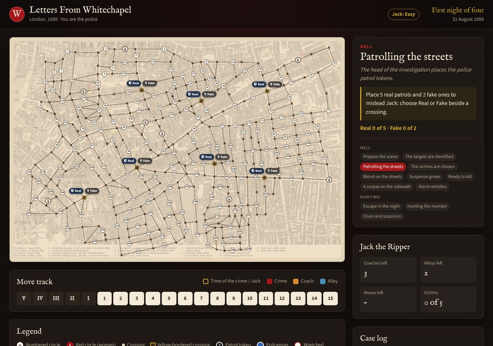
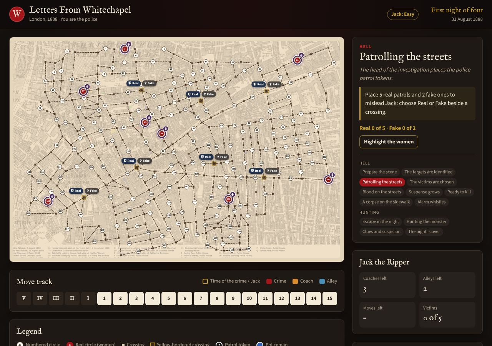
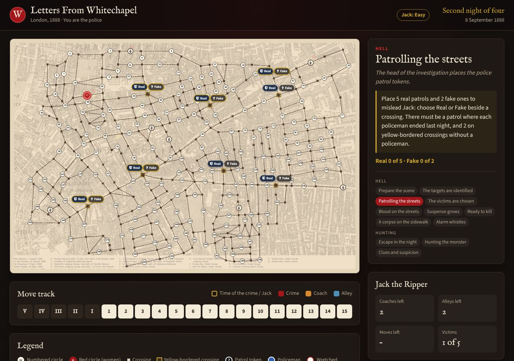
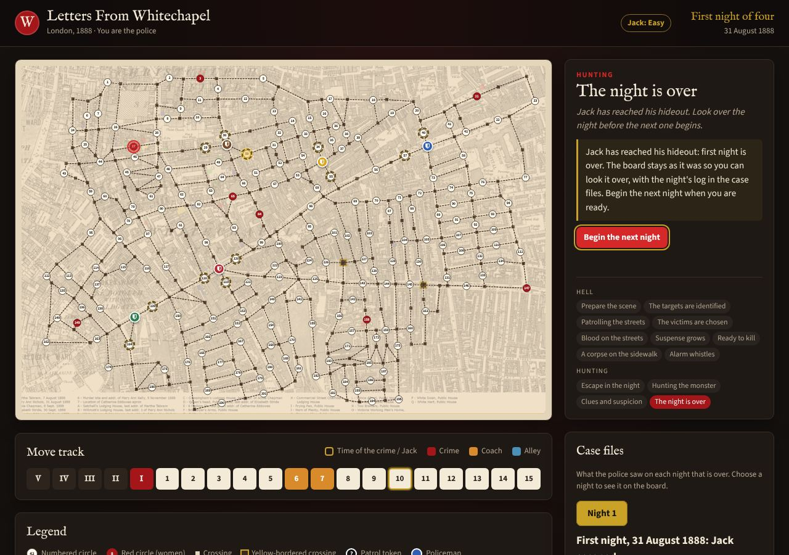

# User interface

The page aims to feel like the board game on a table: a parchment board in a dark Victorian frame, with tokens modelled on the physical pieces.

## Layout

```
┌──────────────────────────────────────────────────────────────┐
│ Top bar: title        Jack: level · Game log   Night · date   │
├───────────────────────────────────────────┬──────────────────┤
│ − Fit +                                   │ Phase card        │
│ Board (fit, or zoomed in and scrolling)   │                   │
│                                           │  part, title,     │
│                                           │  instructions,    │
│                                           │  progress, phases │
├───────────────────────────────────────────┤ Jack the Ripper   │
│ Move track  V IV III II I 1 … 15          │  coaches, alleys, │
├───────────────────────────────────────────┤  moves, victims   │
│ Legend                                    │ Case files        │
│                                           │ Case log          │
└───────────────────────────────────────────┴──────────────────┘
```

The case files card appears once a night is over (see [The detective's tools](#the-detectives-tools)). When the player plays Jack the layout is the same; the phase card holds his choices, and the Jack card shows what he knows ([Playing Jack](playing-jack.md#3-the-two-interfaces-compared)).

Below 1100 pixels wide the page becomes one column, in this order: the phase card (what to do now), the board, the move track, Jack and the case log, then the legend. Below 600 pixels the move track wraps onto two rows and the list of phases is hidden. At **Fit** the board scales to the width available (`WC.ui.draw.fit`); zoomed in, only the board scrolls, never the page (see [Zooming the board](#the-detectives-tools)). Touch screens start zoomed in.

## The detective's tools

These tools help a player keep track of the investigation and play on any screen. None changes the rules or shows anything the police wouldn't see at the table. **Game log** (in the top bar, and at the end) saves the game as a file: see [Game records](game-records.md#1-for-players).

| Before | After |
|---|---|
|  |  |
|  |  |

**Seeing the women and the Wretched.**
- Each woman, and later each Wretched, is a ring around its red circle, with a small badge above it, so the circle's number stays readable.
- Women are face down, so they all look the same (deep purple): which ones are marked is Jack's secret. The Wretched are blood red.
- From Patrolling the streets to the alarm, **Highlight the women** (or **the Wretched**) fades the rest of the map back ([screenshot](images/night-review/after-women-highlight.jpg)).
- In Suspense grows, the Wretched being moved is ringed in brass.

**Undoing a policeman's move.**
- In Hunting the monster, clicking a policeman rings him in brass and rings his possible crossings in his own colour ([screenshot](images/night-review/after-hunting.jpg)).
- **Undo last move** takes back the most recent move: the policeman returns to his crossing and can move again. Repeating it undoes the moves before, newest first ([screenshot](images/night-review/after-undone.jpg)).
- Once everyone has moved, **Done: on to Clues and suspicion** ends the phase. Moves can't be undone after that: searches and arrests reveal information, so the board can't be wound back past them.

**Zooming the board.** Above the board, **−**, **Fit** and **+** change its size. **Fit** shows the whole map in the space available (as on a computer). Zoomed in, the board is a window onto the map that scrolls, panned with a finger or the scroll bars, at most about two thirds of the screen high. On a touch screen the game starts zoomed in, so numbered circles are about 21 pixels across instead of 4–6 on a phone; after each step it scrolls to what can be tapped if none of it is in view. Destination rings are always drawn above the Stay pill. In Clues and suspicion, tapping a policeman brings his Search and Arrest pills to the front, where policemen side by side overlap.

**Searching and arresting.**
- In Clues and suspicion one policeman acts at a time: once he has chosen to search or arrest, the others' choices wait until he has finished. Each policeman's Search here and Arrest here tokens are his own, so policemen beside the same circles never take each other's away.
- **Search his remaining circles** searches the chosen policeman's circles one after another, in order, until a clue turns up.
- **Search with every policeman left** does the same for every policeman who hasn't acted and can search; a policeman who can only arrest is left to choose.

**Reviewing a night.**
- When Jack reaches his hideout, the game stops at **The night is over**. The board keeps the night's policemen, crime scenes, clues, searches without a clue (dashed rings) and failed arrests (crossed rings).
- The **case files** card shows the night's log in order: the murder and the Time of the Crime, where the policemen started and moved, each of Jack's moves by its move-track number (and coaches and alleys), every search and arrest, and his escape ([screenshot](images/night-review/after-review-card.jpg)).
- Clicking a crime scene or clue on the board shows the walking distance from it to the circles around, on an empty board, up to a number of moves you choose. Policemen, coaches and alleys are ignored, so these are a help for reconstructing his route, not proof ([screenshot](images/night-review/after-distances.jpg)).
- **Begin the next night** goes on.
- During later nights, and after the game, the night buttons show any earlier night on the board, read-only, as the police saw it then ([screenshot](images/night-review/after-history.jpg)). Then **Back to the current night**. At the end of the game, **Review the case** in the ending dialog opens the case files.
- The log and the board are drawn from `rules.nightRecord`: a frozen copy of the night's public record, kept when the night ends. It never holds Jack's route, position or hideout.

**Exporting the game log.** **Game log** in the top bar (once the game has begun) and **Export game log** in the ending dialog open the export dialog: the police's record at any time, the full record once the game is over or after the player ends it, ticking that it reveals Jack's secrets. The file is saved on the device; exporting sends nothing ([Game records](game-records.md#1-for-players)).

On a phone the same tools appear in one column ([screenshot](images/night-review/after-mobile.jpg)). Screenshots are made with `tools/screenshots/capture.js`.

## How the interface works

The interface is `js/ui/renderer.js` (`WC.ui`). It displays the game; it doesn't run it (see [Architecture](architecture.md)):

- **It listens to the engine's events** (`game.on`) and draws what changed. For example, `murder` draws the crime scene markers, moves the track and writes the case log entry. `policeTurn` draws the police's choices for that phase.
- **It shows only legal choices, taken from the rules.** These include `rules.patrolPositions`, `rules.wretchedMoves`, `rules.policeDestinations`, and each policeman's `search` and `arrest` lists.
- **It sends clicks to the engine's police actions:** `togglePatrol`, `moveWretched`, `keepWretched`, `movePoliceman`, `undoPoliceMove`, `finishPoliceMoves`, `chooseAction`, `search`, `arrest` and `beginNextNight`. The engine checks the rules again and reports what happened.
- **It turns on two engine settings** (`js/main.js`): `confirmPoliceMoves`, so Hunting the monster waits for Done and a move can be undone, and `reviewNights`, so the game waits after each night. While the computer police play, `confirmPoliceMoves` is off (`js/ui/setup.js`), and the watching player only begins each night.
- **The night review** is `js/ui/review.js` (`WC.ui.review`). It keeps each night's `rules.nightRecord` when the night ends, and draws it on the board and in the case files card, without calling the engine (except `beginNextNight`).
- **It owns all the wording:** instructions, progress lines, case log entries and the endings.

## Components

| Component | Element | Drawn by (`WC.ui.draw`) | On |
|---|---|---|---|
| Night and date | `.night-name`, `.night-date` | `updateTitle` | `phase`, `nightStarted` |
| Phase card | `.phase-part`, `.phase-title`, `.phase-description`, `.phase-steps` | `updateTitle` | `phase` |
| Instructions | `.state.<phase-name>` | `phaseText(name, text)` | `policeTurn`, and phase 4 |
| Progress | `.phase-progress` | `progress(text)` | Police actions' events |
| Jack's status | `.jack-log` | `jackLog` | `nightStarted`, `murder`, `jackMoved` |
| Case log | `.event-log` | `log(text, kind)`, where `kind` is `night`, `crime`, `clue`, `jack`, `police` or `end` | Most events |
| Board | `.board` > `.map` | `streets`, `map`, `createElement` | `started` |
| Move track | `.move-tracker p span` (20 spans) | `tracker` | `timeOfCrime`, `jackWaited`, `murder`, `jackMoved` |
| Dialogs | `.overlay.intro`, `.overlay.ending`, `.overlay.export-dialog` (shown with the `open` class) | Start-up code in `main.js`, the `gameOver` event | |
| Who leads the detectives | `fieldset.police-choice` (hidden, and `.police-options` empty, outside Developer Mode), `.police-options`, `.police-note`; while the computer leads them, `body.computer-police` (the board takes no clicks) and the subtitle says the player is watching | `WC.ui.setup` and `WC.ui.autoPolice(game, police, { delay })` in `js/ui/autopolice.js` | Start button; then the engine's `policeTurn` and `phase` events |
| Role | `.role-options` (`input[name=role]`: `detectives`, `jack`), `.role-note`; `.intro-detectives` / `.intro-jack`; while the player plays Jack, `body.human-jack` and the subtitle says so | `WC.ui.setup` | Start button |
| Opponent's difficulty | `.difficulty-options` (one radio button per offered level of the selected role: as the detectives, Jack's Normal and Hard; as Jack, the detectives' Easy and Normal; in Developer Mode every level with its AI), `.difficulty-legend`, `.difficulty-note`, and `.difficulty-badge` in the top bar; `body.developer-mode` with `?dev=1` | `WC.ui.setup(game, { search, storage })` in `js/ui/setup.js` | Start button; a change of role |
| Jack's decisions (playing Jack) | `.state.jack-turn` (`.jack-turn-title`, `.jack-intro`, `.jack-move-kinds` with `.jack-kind-walk/-alley/-carriage`, `.jack-unavailable`, `.jack-status`, `.jack-confirm`, `.jack-cancel`, `.jack-wait`, `.jack-clear`); `.state.jack-watch` with `.skip-animations`; `.jack-animate-toggle`; `.jack-board-actions` under the board (the status and buttons again, shown only below 1101 pixels) | `WC.ui.jackPlayer` in `js/ui/jack-player.js` | `jackTurn`, `phase`, `policeTurn`; the engine's events for the board and the case log |
| Women and Wretched | `.token-woman`, `.token-wretched`; `button.highlight-pieces` toggles `.board.highlighting` | `pieces` | Every `phase`; `wretchedMoved` |
| Undo and Done | `.state.hunting-the-monster .undo-move`, `.finish-moves` | `moveControls` | `policeTurn` (10), `policemanMoved`, `policeMoveUndone` |
| Export dialog | `.overlay.export-dialog`: `.export-status`, `.export-public`, `.export-full` (`.export-full-note`), `.export-end` (`.export-confirm`, `.export-end-game`), `.export-label`, `.export-comments`, `.export-close`; `.export-open` buttons open it (`.topbar-button` in the top bar); `body.game-ended` once the player ends the game (the board takes no clicks) | `WC.ui.exportLog(game, recorder, { stopWatching, save })` in `js/ui/export.js` | `started` (shows the top bar button); every event while open |
| Playtest records (Developer Mode) | `.playtests-open` (top bar and setup dialog), `.overlay.playtests-dialog`: `.playtests-count`, `.playtests-export-new`, `.playtests-export-selected`, `.playtests-export-all`, `.playtests-import` (`.playtests-file`), `.playtests-status`, `.playtests-table` (`.playtests-rows`, `.playtests-select`, `.playtests-download`, `.playtests-delete`), `.playtests-clear-confirm`, `.playtests-clear`, `.playtests-close`; `.playtest-saved` in the ending dialog | `WC.ui.playtests(store, { dev, save, submitter })` and `WC.ui.playtestSaved` in `js/ui/playtests.js` ([Human playtests](playtests.md)); the table's **Online** column (`.playtests-online`) and `.playtests-submit` | Opening the dialog; the end of a game |
| Anonymous Gameplay Research | `.research-notice` (setup dialog), `.research-open` (top bar), `.overlay.research-dialog` (`.research-toggle`, `.research-state`, `.research-privacy`, `.research-close`), `.research-about`; `.playtest-submitted` in the ending dialog. Hidden unless the site has an intake address | `WC.ui.research(submitter)` in `js/ui/research.js`; `WC.submission` in `js/ui/submission.js` ([Automatic playtest collection](automatic-playtest-collection.md#2-for-players)) | Page load; the switch; the end of a game |
| Case files | `.review-card`: `.review-nights` (one `.review-night` button per night), `.review-body` (`.review-log`, `.review-radius`, `.begin-next-night` or `.close-review`); `.board.reviewing` while a night is shown | `WC.ui.review` | `nightOver`, `gameOver`, `.review-case` in the ending dialog |

## Tokens on the board

| Looks like | Classes | Meaning |
|---|---|---|
| White circle with a number | `location-number` | Numbered circle |
| Red circle with a number | `location-number location-murder` | Red numbered circle |
| Small dark square | `location` | Crossing |
| Square with a brass outline | `location location-station` | Yellow-bordered crossing |
| "Real" / "Fake" pills | `token-police marked` / `unmarked` (`selected`, `required`) | Choosing patrols |
| Black disc with "?" | `token-police` | Face-down patrol |
| Coloured disc with a shield | `token-police police-N`, `token-pawn police-N` | Policeman N (blue, yellow, brown, red, green) |
| Purple ring with a badge | `token-woman` | A woman, face down (marked or not: only Jack knows) |
| Red ring with a badge | `token-wretched` (`selectable`, `selected`) | A Wretched |
| Ring in a policeman's colour | `token-move-police for-police-N` | Where policeman N can move |
| Green ring | `token-move-wretched` | Where a Wretched can move |
| Brass ring around a policeman | `token-police selected` | The policeman whose crossings are showing |
| "Search" / "Arrest" pills | `token-search-adjacent`, `token-arrest-adjacent` | A policeman's choice of action |
| Disc with a magnifier or gavel | `token-search`, `token-arrest` | A circle to search or arrest at |
| Translucent yellow disc | `token-clue` | Clue marker |
| Translucent red disc | `token-murder crime-scene` | Crime scene marker |
| Gold ring with a house badge | `jv-hideout` | Jack's hideout (playing Jack) |
| Red pawn | `jv-jack` | Jack (playing Jack) |
| Small numbered dot | `jv-trail` | Jack's route tonight, in order (playing Jack) |
| Gold, blue or orange ring | `jv-choice` with `jv-target`, `jv-dest-walk`, `jv-dest-alley`, `jv-dest-carriage` (`jv-dest-home` on the hideout), `jv-via`, `jv-picked` once picked | A choice for Jack: a hideout, a woman, a victim, a patrol to reveal, a destination, a coach's stop |
| Policeman that glides | `token-pawn jv-police police-N` (`.board.jv-still` or `.jv-hurry` stops the glide) | Policeman N, from Jack's side |
| Review markers (only while a night is shown) | `review` with `review-crime` (`review-earlier`), `review-clue`, `review-searched`, `review-arrest`, `review-police`, `review-distance-N` | A night's crime scenes, clues, searches without a clue, failed arrests, where the policemen ended, and walking distances |

Pieces that can be clicked have the `selectable` class, which gives them a pointer, a hover ring and (for pieces still to move) a gentle pulse.

## The class contract

The game code and the tests find elements by class name, so keep these classes when restyling: `token`, `selectable`, `token-police`, `marked`, `unmarked`, `selected`, `required`, `token-woman`, `token-wretched`, `token-move-wretched`, `token-move-police`, `token-pawn`, `token-search-adjacent`, `token-arrest-adjacent`, `token-search`, `token-arrest`, `token-clue`, `token-murder`, `location`, `location-number`, `state`, `game-over`, `jack-log`, `move-tracker`, `highlight-pieces`, `highlighting`, `undo-move`, `finish-moves`, `search-rest`, `search-everyone`, `waiting`, `front`, `zoomed`, `board-sizer`, `zoom-in`, `zoom-out`, `zoom-fit`, `for-police-N`, `review`, `reviewing`, `review-night`, `review-log`, `begin-next-night`, `close-review`, `review-case`, `export-open`, `export-dialog`, `export-public`, `export-jack`, `export-full`, `export-confirm`, `export-end-game`, `game-ended`, `human-jack`, `jack-turn`, `jack-watch`, `jack-confirm`, `jack-cancel`, `jack-wait`, `jack-clear`, `jack-kind`, `skip-animations`, the `jv-` classes above, and the `carriage`, `alley`, `murder` and `active` classes on track spaces.

Two of these behave in a way that matters:

- `$('.token').remove()` clears the board at the end of a phase or night, so crime scene markers deliberately don't have the `token` class.
- The Real and Fake pills for a crossing are adjacent siblings, and the code uses `.next()` and `.prev()` to switch between them.

## Design tokens

Colours, radius, shadow and fonts are CSS variables at the top of `css/style.css`:

| Token | Use |
|---|---|
| `--ink`, `--ink-raised`, `--ink-line` | Page background, cards, borders |
| `--paper`, `--paper-dim` | The board and dialogs |
| `--text`, `--text-dim`, `--text-on-paper` | Text |
| `--blood`, `--blood-bright` | Murders, Hell, primary buttons |
| `--brass` | Highlights: current move, progress, required patrols |
| `--clue`, `--coach`, `--alley` | Markers and move-track colours |
| `--police-blue`, `--police-yellow`, `--police-brown`, `--police-red`, `--police-green` | The five policemen |
| `--font-display`, `--font-body` | IM Fell English for headings, Source Sans 3 for text (from Google Fonts, falling back to Georgia and system fonts offline) |

## Accessibility

- Every place and token has a `title` naming what it is and its number, for example "Search here (number 82)".
- The phase progress and the case log are `aria-live` regions, so screen readers announce changes.
- The dialogs use `role="dialog"` and `aria-modal`, and the start button takes focus.
- The pulsing animation is switched off when the system asks for reduced motion.
- Colour is never the only signal: track spaces keep their numerals, and tokens have icons and labels.

## Adding to the UI

- **New phase instructions:** in `renderer.js`, call `draw.phaseText('<state-class>', text)` in that phase's `turns` function, and add the `.state` div to the phase card in `index.html` if it is new.
- **Something the police learn:** have the engine report an event with the facts. Then add a handler in `renderer.js`'s `events` that calls `draw.log(text, kind)`.
- **A new token:** create it with `draw.createElement(mapid, label, 'token token-<name> ...')`, then style `.map .token-<name>` in `style.css`. Size it in board pixels; the board scales as a whole.
- **A new police action:** add the action to the engine (it checks a rule from `rules.js`), then a click in `renderer.js` that calls it. Don't decide in the interface whether the action is legal.
- **Selecting elements:** prefer simple class selectors and filter functions over jQuery's `:not()`, `.not(selector)` and similar. Some of those make jQuery draw on `Math.random`, which shifts Jack's random choices in seeded games (see [Testing](testing.md#golden-traces)).
